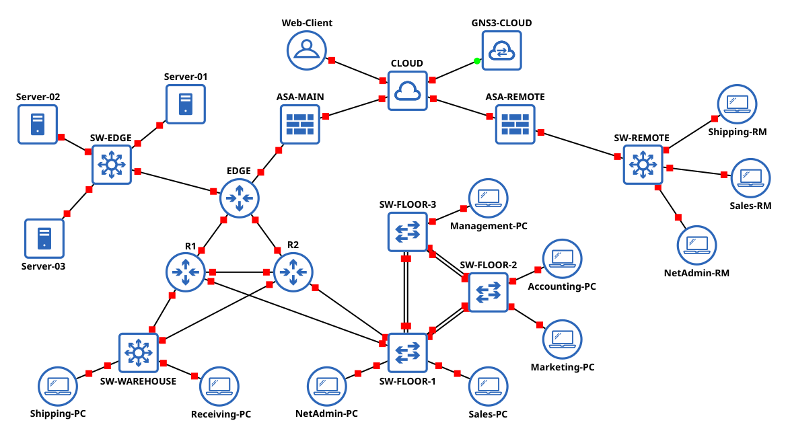

# **cisco-enterprise-gns3-network**

A comprehensive GNS3-based enterprise network built with Cisco IOS and ASAv
platforms, demonstrating scalable design, advanced routing, high availability,
security integration, and structured network documentation.

---

## Table of Contents

1. [Overview](#1-overview)  
&nbsp;&nbsp;1.1 [Network Purpose and Scope](#11-network-purpose-and-scope)  
&nbsp;&nbsp;1.2 [Technologies and Skills Demonstrated](#12-technologies-and-skills-demonstrated)  
2. [Network Architecture and Design](#2-network-architecture-and-design)  
&nbsp;&nbsp;2.1 [IP Addressing Scheme](#21-ip-addressing-scheme)  
&nbsp;&nbsp;2.2 [Network Topology](#22-network-topology)  
&nbsp;&nbsp;2.3 [Device Inventory](#23-device-inventory)  
&nbsp;&nbsp;2.5 [Interface and IP Assignments](#25-interface-and-ip-assignments)  
3. [Implementation](#3-implementation)  
&nbsp;&nbsp;3.1 [Edge Site (Network Perimeter)](#31-edge-site-network-perimeter)  
&nbsp;&nbsp;3.2 [Main Site](#32-main-site)  
&nbsp;&nbsp;3.3 [Server Room](#33-server-room)  
&nbsp;&nbsp;3.4 [Warehouse](#34-warehouse)  
&nbsp;&nbsp;3.5 [Remote Site](#35-remote-site)  
&nbsp;&nbsp;3.6 [Network Device Hardening](#36-network-device-hardening)  
&nbsp;&nbsp;3.7 [External Connectivity and Testing](#37-external-connectivity-and-testing)  
4. [Testing and Validation](#4-testing-and-validation)  
5. [Appendices](#appendices)  
&nbsp;&nbsp;A. [Device Configuration Files](#a-device-configuration-files)  
&nbsp;&nbsp;B. [References](#b-references)  
&nbsp;&nbsp;C. [License](#c-license)  

---

## 1. Overview

### 1.1 Network Purpose and Scope

This repository presents the design and implementation of an enterprise-grade
network built using Cisco networking and security technologies. Constructed in
GNS3, the network demonstrates a layered, secure, and scalable architecture
that integrates core routing, switching, VLAN segmentation, redundancy,
security policy enforcement, and remote connectivity via site-to-site VPN.

Developed through a combination of real-world experience, CCNA coursework,
self-study, and hands-on experimentation with Cisco IOS and ASA platforms,
this project serves to showcase my ability to design, configure, and document
a complex network environment in alignment with industry best practices.

This repository is intended for technical professionals and hiring managers
seeking to evaluate my practical understanding of enterprise networking and
security principles. I invite you to explore the implementation details that
follow, which reflect both my technical proficiency and my commitment to
clean, structured network design.

### 1.2 Technologies and Skills Demonstrated

This section highlights the key technologies and networking concepts
demonstrated throughout the network implementation.

#### Routing and Switching

- Open Shortest Path First (OSPF) for dynamic routing
- Hot Standby Router Protocol (HSRP) for gateway redundancy
- Inter-VLAN routing for network segmentation
- Layer 2 switching (access and trunk ports)
- Layer 3 routing (subinterfaces)
- Layer 3 switching using Switched Virtual Interfaces (SVI)
- VLAN Trunking Protocol (VTP) for VLAN synchronization
- EtherChannel with LACP for link aggregation and redundancy
- Rapid PVST+ for loop prevention and per-VLAN spanning tree configuration
- Manual root bridge assignment for VLANs to control traffic paths

#### Security

- Internet Key Exchange version 2 (IKEv2) and IPsec for secure tunneling
- Access Control Lists (ACLs) for traffic filtering and policy enforcement
- Static and dynamic NAT/PAT for address translation
- Port security (MAC limiting, PortFast, BPDU Guard) to prevent unauthorized
  access
- Secure remote access via SSH version 2
- Access control for VTY lines using ACLs
- Disabling of insecure services (Telnet, HTTP, CDP, DTP)

#### Network Services

- Dynamic Host Configuration Protocol (DHCP) for IP address assignment
- Network Time Protocol (NTP) for clock synchronization
- HTTP server deployment for service demonstration
- Static NAT for internal server accessibility

#### Automation and Testing

- Bash scripting for automated network validation
- End-to-end testing of connectivity, NAT, and ACL policies
- Public IP range simulation for external access testing
- External client simulation for validating web service accessibility

#### Simulation and Management

- GNS3 virtualization platform for network simulation
- GNS3 Cloud Appliance for integration with the host network

---

## 2. Network Architecture and Design

### 2.1 IP Addressing Scheme

The network uses private IPv4 address space for internal segmentation and
simulated public ranges to demonstrate external server access, internet
connectivity, and site-to-site VPN operations, with a scheme designed to
ensure segmentation, consistent subnetting, and scalability.

Point-to-point links use `/30` subnets for efficient utilization.
Main Site links range from `172.16.1.0/30` to `172.16.1.24/30`.
The Remote Site uses `172.16.2.0/30`.

User VLANs are assigned `/24` subnets for scalability and manageability.
Main Site VLANs reside in the `10.1.0.0/16` block.
Remote Site VLANs reside in the `10.2.0.0/16` block.
Each VLAN is assigned a network-aligned default gateway.

Public simulation ranges include `172.20.1.0/29` (Main Site),
`172.25.1.0/24` (Remote Site), and `172.30.1.0/24` (simulated external host).
These ranges are used to model NAT and internet access scenarios.

### 2.2 Network Topology



### 2.3 Device Inventory

The following virtual appliances were used in the GNS3 simulation environment:

| Device Type | GNS3 Appliance      | Image Type | OS/Version               |
|-------------|---------------------|------------|--------------------------|
| Router      | Cisco IOSv          | QEMU       | Cisco IOS 15.9(3)M9      |
| Switch      | Cisco IOSvL2        | QEMU       | Cisco IOS 15.2(20200924) |
| ASA         | Cisco ASAv          | QEMU       | Cisco ASA 9.22(1)1       |
| End Host    | Alpine Linux        | Docker     | Alpine Linux 3.22.0      |
| Server      | Networkers' Toolbox | Docker     | Ubuntu 20.04.2 LTS       |

### 2.4 VLAN Table

| Location    | VLAN | Name       | Network       |
| ------------| ---- | ---------- | ------------- |
| Server Room | 10   | Server     | 10.1.10.0 /24 |
| Main Site   | 20   | NetAdmin   | 10.1.20.0 /24 |
|             | 30   | Sales      | 10.1.30.0 /24 |
|             | 40   | Marketing  | 10.1.40.0 /24 |
|             | 50   | Accounting | 10.1.50.0 /24 |
|             | 60   | Management | 10.1.60.0 /24 |
| Warehouse   | 70   | Shipping   | 10.1.70.0 /24 |
|             | 80   | Receiving  | 10.1.80.0 /24 |
| Remote Site | 20   | NetAdmin   | 10.2.20.0 /24 |
|             | 30   | Sales      | 10.2.30.0 /24 |
|             | 70   | Shipping   | 10.2.70.0 /24 |

### 2.5 Interface and IP Assignments

```
TODO: Add Device Interface and IP Addressing Table
```

---

## 3. Implementation

This section outlines the implementation of the network design, organized
in a logical progression: starting with the network perimeter, followed by
internal sites, then the remote site, and concluding with the devices used
to validate external connectivity and verify security policies.

### 3.1 Edge Site (Network Perimeter)

The **Edge Site** serves as the network perimeter, functioning as the primary
gateway for internet access, external connectivity, and security enforcement.
The two components of this site are the `EDGE` Router and the Cisco Adaptive
Security Appliance `ASA-MAIN`, which ensure controlled and secure
communication between internal and external networks.

#### ASA-MAIN

- **Role:** Acts as the primary network perimeter security device, enforcing
  security policies and controlling internal access to the remote site and
  the internet.

- **Key Features:**
  - **Network Address Translation (NAT/PAT):**
    - Static NAT for internal servers using IPs `172.20.1.3`–`172.20.1.5`.
    - Dynamic PAT for all internal hosts using IP `172.20.1.6`.
  - **Access Control Lists (ACLs):**
    - Extended ACL applied to the `outside` interface to allow external
      HTTP/HTTPS and ICMP traffic to internal servers.
    - Crypto ACL to determine whether outbound traffic is routed via NAT/PAT
      or encapsulated in the site-to-site VPN tunnel.
  - **Stateful Inspection:** Ensures only legitimate, session-aware traffic
    is allowed through the perimeter.
  - **Site-to-Site IKEv2 VPN:** A secure, encrypted tunnel established with
    `ASA-REMOTE` using IP `172.20.1.2` to maintain confidentiality and
    integrity of data transmitted between the main network and the remote site.

- **Connectivity:**
  - **Outside Interface:**
    Connected to the `CLOUD` Router for internet access.
  - **Inside Interface:**
    Connected to `EDGE` Router for internal network access.

#### EDGE Router

- **Role:** Serves as the central aggregation point for internal traffic,
  while also providing DHCP and NTP network services.

- **Key Features:**
  - **Default Route:** Configured to forward all external-bound traffic to
    `ASA-MAIN`.
  - **OSPF Routing:** Participates in the OSPF routing domain to ensure
    dynamic path selection and redundancy within the internal network.
  - **DHCP Server:** Provides dynamic IP address allocation to internal
    clients across the network.
  - **NTP Server:** Functions as the primary NTP master, synchronizing time
    across all network devices for consistency and accurate logging.

- **Connectivity:**
  - Connected to `ASA-MAIN` inside interface for internet access.
  - Connected to `SW-EDGE` for access to the Server Room.
  - Connected to `R1` and `R2` to facilitate internal site routing.

### 3.2 Main Site

The **Main Site** serves as the central operational hub of the network,
hosting end-user devices, departmental VLANs, and core connectivity to
internal and external services. The architecture incorporates redundancy
and segmentation through the use of multiple Layer 2 switches and dual
Layer 3 routers (`R1` and `R2`) to support inter-VLAN routing and failover
capabilities.

#### SW-FLOOR-1, SW-FLOOR-2, SW-FLOOR-3 (Layer 2 Switches)

- **Role:** Provide connectivity for end-user devices across multiple
  departments and physical floors.

- **Key Features:**
  - **VLAN Trunking:** Interfaces configured as trunks to carry traffic for
    multiple VLANs between switches.
  - **VLAN Trunking Protocol (VTP):** `SW-FLOOR-1` operates as the VTP server,
    with `SW-FLOOR-2` and `SW-FLOOR-3` configured as VTP clients to ensure
    consistent VLAN database synchronization.
  - **EtherChannel:** Trunk links between switches utilize LACP-based
    EtherChannel for increased bandwidth, redundancy, and fault tolerance.
  - **Inter-VLAN Routing:** Connected to `R2` for primary inter-VLAN routing,
    with a backup connection to `R1`.
  - **Rapid PVST+ Configuration:**
    - Rapid Per-VLAN Spanning Tree (PVST+) enabled across all VLANs to prevent
      loops and ensure Layer 2 redundancy.
    - **Root Primaries:**
      - `SW-FLOOR-1`: VLANs 20 (NetAdmin), 30 (Sales)
      - `SW-FLOOR-2`: VLANs 40 (Marketing), 50 (Accounting)
      - `SW-FLOOR-3`: VLAN 60 (Management)
    - **Root Secondaries:**
      - `SW-FLOOR-1`: VLAN 60 (Management)
      - `SW-FLOOR-2`: VLANs 20 (NetAdmin), 30 (Sales)
      - `SW-FLOOR-3`: VLANs 40 (Marketing), 50 (Accounting)
    - Bridge priorities have been configured to ensure predictable election of
      root bridges during both normal operation and failover scenarios.

- **Connectivity:**
  - End-user devices connected via access ports assigned to specific VLANs.
  - Trunk links established between switches using EtherChannel.
  - `SW-FLOOR-1` connects to both `R2` and `R1` to ensure routing redundancy.

#### R1 (Layer 3 Router)

- **Role:** Primary router for `SW-WAREHOUSE` and backup inter-VLAN router
  for `SW-FLOOR-1`.

- **Key Features:**
  - **Inter-VLAN Routing:** Configured with subinterfaces to support
    inter-VLAN communication.
  - **OSPF Routing:** Participates in the internal OSPF routing domain with
    an adjusted cost metric to prioritize traffic from `SW-WAREHOUSE`.
  - **HSRP Configuration:** Subinterfaces are configured with HSRP to
    provide redundancy for VLAN routing.

- **Connectivity:**
  - Connected to `EDGE` Router for access to core services and the internet.
  - Primary connection to `SW-WAREHOUSE` for warehouse VLAN traffic.
  - Backup connection to `SW-FLOOR-1` for inter-VLAN routing redundancy.

#### R2 (Layer 3 Router)

- **Role:** Primary inter-VLAN router for `SW-FLOOR-1` and backup router for
  `SW-WAREHOUSE`.

- **Key Features:**
  - **Inter-VLAN Routing:** Configured with subinterfaces to support
    inter-VLAN communication.
  - **OSPF Routing:** Participates in the internal OSPF routing domain with
    an adjusted cost metric to prioritize traffic from `SW-FLOOR-1`.
  - **HSRP Configuration:** Subinterfaces are configured with HSRP to
    provide redundancy for VLAN routing, with priority and preemption enabled.

- **Connectivity:**
  - Connected to `EDGE` Router for access to core services and the internet.
  - Primary connection to `SW-FLOOR-1` for inter-VLAN routing.
  - Backup connection to `SW-WAREHOUSE` for redundancy.

### 3.3 Server Room

The **Server Room** serves as the centralized location for hosting internal
and external network services. In this topology, HTTP servers are used to
demonstrate secure access from both internal users and external clients.
The design is scalable and can be extended to accommodate additional
services such as application or database servers.

#### SW-EDGE (Layer 3 Switch)

- **Role:** Acts as the gateway for the server VLAN and provides connectivity
  to the **Edge Site**.

- **Key Features:**
  - **Switched Virtual Interface (SVI):** Configured on the switch to provide
    Layer 3 reachability for the server VLAN.
  - **OSPF Integration:** Participates in the internal OSPF routing domain to
    ensure seamless communication with other network segments.

- **Connectivity:**
  - Servers are connected to access ports assigned to the dedicated server
    VLAN.
  - Connected to the `EDGE` Router to enable communication with internal
    clients and external internet access via `ASA-MAIN`.

#### Servers

- **Role:** Host internal and externally accessible HTTP services,
  demonstrating secure service delivery and network segmentation.

- **Key Features:**
  - **Dedicated VLAN Assignment:** Servers reside on a separate VLAN to
    enforce network segmentation and enhance security.
  - **Static IP Addressing:** Servers are configured with static IP
    addresses for reliable service access and NAT configuration.
  - **Controlled Accessibility:** Access to these servers from external
    networks is governed by access control rules and facilitated via static
    NAT on `ASA-MAIN`.

- **Connectivity:**
  - **Internal Access:** Connected to `SW-EDGE` for communication with
    internal clients.
  - **External Access:** Enabled through static NAT and ACLs configured on
    `ASA-MAIN`.

### 3.4 Warehouse

The **Warehouse** site functions as a supporting network segment located
adjacent to the **Main Site**. The current topology includes a single Layer 3
switch and is designed to accommodate future expansion, such as the addition
of wireless access points, inventory systems, logistics devices, and other
operational tools used in warehouse management.

#### SW-WAREHOUSE (Layer 3 Switch)

- **Role:** Serves as the central switching and routing point for the
  Warehouse network, supporting both Layer 2 connectivity and inter-VLAN
  communication.

- **Key Features:**
  - **VLAN Segmentation:** Multiple VLANs configured to support different
    types of warehouse devices.
  - **Layer 3 Routing via SVIs:** Switched Virtual Interfaces (SVIs)
    configured to provide Layer 3 connectivity and enable local inter-VLAN
    routing.
  - **OSPF Integration:** Participates in the internal OSPF routing domain to
    maintain dynamic reachability and support seamless integration with the
    rest of the network.

- **Connectivity:**
  - End-user devices connected via access ports assigned to specific VLANs.
  - Connected to `R1` (primary) and `R2` (backup) in the Main Site to ensure
    redundant routing paths and network resilience.

### 3.5 Remote Site

The **Remote Site** represents a geographically separate location such as a
home office, branch office, or satellite facility. It maintains secure
connectivity to the main network via a site-to-site **IKEv2 VPN tunnel** and
provides local network services to remote users. This design supports
secure, scalable, and segmented access to both local and corporate resources.

#### SW-REMOTE (Layer 3 Switch)

- **Role:** Provides integrated Layer 2 access and Layer 3 routing for local
  users and devices.

- **Key Features:**
  - **VLAN Segmentation:** Separate VLANs configured to ensure logical
    separation of user traffic across the site-to-site VPN tunnel.
  - **Layer 3 Routing via SVIs:** Switched Virtual Interfaces (SVIs)
    configured to provide Layer 3 connectivity and enable local inter-VLAN
    routing.

- **Connectivity:**
  - End-user devices connected via access ports assigned to specific VLANs.
  - Connected to `ASA-REMOTE` inside interface for internet access.

#### ASA-REMOTE

- **Role:** Acts as the security gateway for the Remote Site, enforcing access
  control and managing secure connectivity to the Edge Site.

- **Key Features:**
  - **Port Address Translation (PAT):** Enables internal hosts to access the
    internet using a shared public IP address.
  - **Access Control Lists (ACLs):** Crypto ACLs determine whether traffic is
    routed directly to the internet via PAT or encapsulated and sent through
    the site-to-site VPN tunnel.
  - **Stateful Inspection:** Ensures only legitimate, session-aware traffic
    is allowed through the perimeter.
  - **Site-to-Site IKEv2 VPN:** A secure, encrypted tunnel established with
    `ASA-MAIN` to maintain confidentiality and integrity of data transmitted
    between the Remote Site and the main network.

- **Connectivity:**
  - **Outside Interface:** Connected to the `CLOUD` Router for internet
    access.
  - **Inside Interface:** Connected to `SW-REMOTE` for local network access.

### 3.6 Network Device Hardening

In addition to their functional roles, all network devices have been
configured with security best practices in mind:

- **Switchport Security:**
  - All unused switchports have been manually shut down.
  - Switchports are configured by default as access ports and assigned to a
    non-routable VLAN to prevent unauthorized access and mitigate potential
    VLAN hopping attacks.
  - Access ports are configured to dynamically learn MAC addresses,
    permitting a total of two MAC addresses before a security violation occurs.
  - Access ports are configured to use PortFast and BPDU Guard to mitigate STP
    manipulation attacks.

- **Secure Remote Access:**
  - All devices are configured to allow SSH-only remote management.
  - SSH version 2 is enforced with strong encryption and authentication.
  - Access to VTY lines is restricted using ACLs that permit connections only
    from authorized NetAdmin networks.
  - Telnet access is explicitly disabled.

- **Unnecessary Services Disabled:**
  - Cisco Discovery Protocol (CDP) is disabled on all devices to mitigate the
    potential exploitation of network infrastructure vulnerabilities.
  - HTTP and HTTPS server functions are disabled on all devices, as they are
    not required for network operation and pose a potential security risk if
    left enabled.
  - Dynamic Trunking Protocol (DTP) is disabled on all switchports.

> [!NOTE]
> For demonstration and ease of review, the following non-secure settings
> have been intentionally configured:
> - Console and AUX port passwords have been disabled.
> - Privileged EXEC (enable) password has been disabled.
> - `exec-timeout` has been set to `0 0` to prevent session timeouts.
> - `privilege level` has been set to `15` to provide immediate access to
>   privileged EXEC mode.
>
> These configurations are **not suitable for production environments** and are
> applied solely to improve accessibility during evaluation.

### 3.7 External Connectivity and Testing

This section outlines the **external connectivity components** used to
validate the network’s behavior under real-world conditions. These elements
are not part of the internal enterprise network but are essential for
testing **NAT policies**, **access control rules**, and **internet access**.
The network uses simulated public IP ranges to represent the **Main Site**,
**Remote Site**, and a test client.

#### CLOUD Router

- **Role:** Functions as a simulated ISP gateway, used to represent external
routing and enable connectivity between public IP ranges.

- **Key Features:**
  - **Static Routing:** Configured with static routes to allow return traffic
    for NAT-translated communications.
  - **Public IP Simulation:** Used to simulate public IP ranges for:
    - **Main Site:** `172.20.1.2`–`172.20.1.6`
    - **Remote Site:** `172.25.1.2`
    - **External Web Client:** `172.30.1.2`
  - **Connectivity Testing:** Enables testing of site-to-site communication,
    NAT policies, and internet access.

- **Connectivity:**
  - Connected to `ASA-MAIN` outside interface.
  - Connected to `ASA-REMOTE` outside interface.
  - Connected to `Web-Client` to simulate an external host.

#### GNS3 Cloud Appliance

- **Role:** Provides a bridge between the GNS3 virtual network and the host
  machine’s physical network.

- **Key Features:**
  - **Host Network Integration:** Connected to the host machine's ethernet
    adapter, allowing the virtual network to reach external DNS, web services,
    or perform software updates.
  - **Not Part of Logical Design:** This device is used solely for **testing
    and connectivity purposes** within the simulation environment and does
    not represent a real enterprise network component.

- **Connectivity:**
  - Connected to `CLOUD` Router to provide internet access.
  - Connected to internet via host ethernet adapter.

#### Web-Client (Simulated External Host)

- **Role:** Represents an internet-based client accessing internal
  HTTP services behind `ASA-MAIN`.

- **Key Features:**
  - **Static IP Configuration:** Assigned the IP `172.30.1.2` to simulate an
    external web client.
  - **Testing Capabilities:**
    - Static NAT is correctly translating internal server addresses.
    - ACLs are permitting HTTP/HTTPS and ICMP traffic.
    - Web services are accessible from outside the network.

- **Connectivity:**
  - Connected to `CLOUD` Router for simulated internet access.

---

## 4. Testing and Validation

```
TODO: Add Testing and Validation Section
```

---

## Appendices

### A. Device Configuration Files

```
TODO: Add Configuration Files
```

### B. References

```
TODO: Add References
```

### C. License

This project is licensed under the GNU General Public License v3.0.  
A copy of the license is available in the `LICENSE` file.

---

