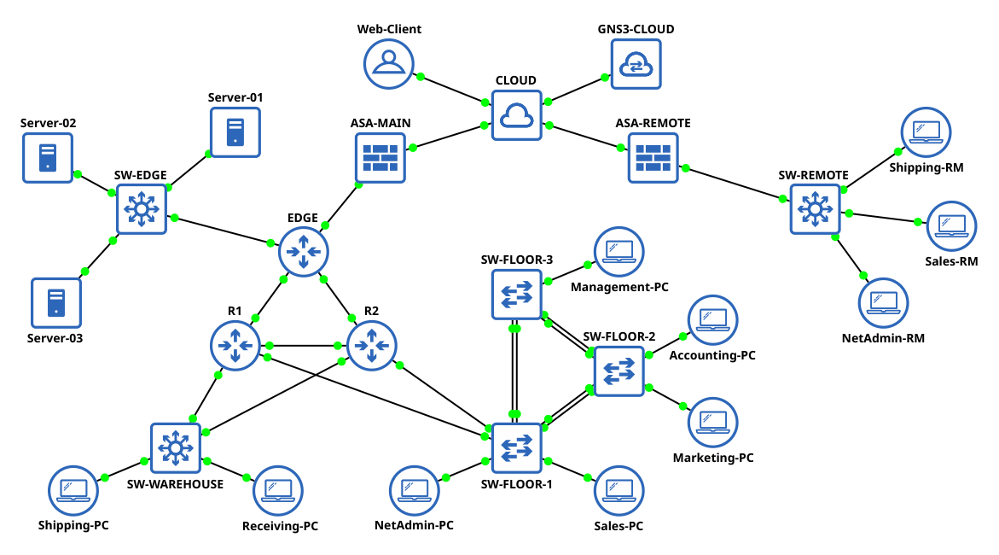

# **cisco-enterprise-gns3-network**

A comprehensive GNS3-based enterprise network built with Cisco IOS and ASAv
platforms, demonstrating scalable design, advanced routing, high availability,
security integration, and structured network documentation.

---

## Table of Contents

1. [Overview](#1-overview)  
&nbsp;&nbsp;&nbsp;&nbsp;1.1 [Network Purpose and Scope](#11-network-purpose-and-scope)  
&nbsp;&nbsp;&nbsp;&nbsp;2.2 [Technologies and Skills Demonstrated](#12-technologies-and-skills-demonstrated)  
2. [Network Architecture and Design](#2-network-architecture-and-design)  
3. [Implementation](#3-implementation)  
4. [Testing and Validation](#4-testing-and-validation)  
5. [Appendices](#appendices)  

---

## 1. Overview

### 1.1 Network Purpose and Scope

This repository presents the design and implementation of an enterprise-grade
network built using Cisco networking and security technologies. Constructed in
GNS3, the network demonstrates a layered, secure, and scalable architecture
that integrates core routing, switching, VLAN segmentation, redundancy,
security policy enforcement, and remote connectivity via site-to-site VPN.

Developed through a combination of real-world experience, CCNA coursework,
self-study, and hands-on experimentation with Cisco IOS and ASA platforms,
this project serves to showcase my ability to design, configure, and document
a complex network environment in alignment with industry best practices.

This repository is intended for technical professionals and hiring managers
seeking to evaluate my practical understanding of enterprise networking and
security principles. I invite you to explore the implementation details that
follow, which reflect both my technical proficiency and my commitment to
clean, structured network design.

### 1.2 Technologies and Skills Demonstrated

This section highlights the key technologies and networking concepts
demonstrated throughout the network implementation.

#### Routing and Switching

- Open Shortest Path First (OSPF) for dynamic routing
- Hot Standby Router Protocol (HSRP) for gateway redundancy
- Inter-VLAN routing for network segmentation
- Layer 2 switching (access and trunk ports)
- Layer 3 routing (subinterfaces)
- Layer 3 switching using Switched Virtual Interfaces (SVI)
- VLAN Trunking Protocol (VTP) for VLAN synchronization
- EtherChannel with LACP for link aggregation and redundancy
- Rapid PVST+ for loop prevention and per-VLAN spanning tree configuration
- Manual root bridge assignment for VLANs to control traffic paths

#### Security

- Internet Key Exchange version 2 (IKEv2) and IPsec for secure tunneling
- Access Control Lists (ACLs) for traffic filtering and policy enforcement
- Static and dynamic NAT/PAT for address translation
- Port security (MAC limiting, PortFast, BPDU Guard) to prevent unauthorized
  access
- Secure remote access via SSH version 2
- Access control for VTY lines using ACLs
- Disabling of insecure services (Telnet, HTTP, CDP, DTP)

#### Network Services

- Dynamic Host Configuration Protocol (DHCP) for IP address assignment
- Network Time Protocol (NTP) for clock synchronization
- HTTP server deployment for service demonstration
- Static NAT for internal server accessibility

#### Automation and Testing

- Bash scripting for automated network validation
- End-to-end testing of connectivity, NAT, and ACL policies
- Public IP range simulation for external access testing
- External client simulation for validating web service accessibility

#### Simulation and Management

- GNS3 virtualization platform for network simulation
- GNS3 Cloud Appliance for integration with the host network

---

## 2. Network Architecture and Design

### 2.1 IP Addressing Scheme

The network uses private IPv4 address space for internal segmentation and
simulated public ranges to demonstrate external server access, internet
connectivity, and site-to-site VPN operations, with a scheme designed to
ensure segmentation, consistent subnetting, and scalability.

Point-to-point links use `/30` subnets for efficient utilization.
Main Site links range from `172.16.1.0/30` to `172.16.1.24/30`.
The Remote Site uses `172.16.2.0/30`.

User VLANs are assigned `/24` subnets for scalability and manageability.
Main Site VLANs reside in the `10.1.0.0/20` block.
Remote Site VLANs reside in the `10.2.0.0/20` block.
Each VLAN is assigned a network-aligned default gateway.

Public simulation ranges include `172.20.1.0/29` (Main Site),
`172.25.1.0/24` (Remote Site), and `172.30.1.0/24` (simulated external host).
These ranges are used to model NAT and internet access scenarios.

### 2.2 Network Topology



### 2.3 Device Inventory

The following virtual appliances were used in the GNS3 simulation environment:

| Device   | GNS3 Appliance      | Version Used          | Role in Network |
|----------|---------------------|-----------------------|-----------------|
| Router   | Cisco IOSv          | 15.9(3)M9             | Core routing and site interconnect |
| Switch   | Cisco IOSvL2        | 15.2(20200924:215240) | VLAN switching and Layer 2 connectivity |
| ASA      | Cisco ASAv          | 9.22(1)1              | NAT, security policy, and site-to-site VPN termination |
| End Host | Alpine Linux        | 3.22.0                | User simulation and connectivity testing |
| Server   | Networkers' Toolbox | Ubuntu 20.04.2 LTS    | Web services for testing |

### 2.4 VLAN Table

| Location    | VLAN | Name       | Network       |
| ------------| ---- | ---------- | ------------- |
| Server Room | 10   | Server     | 10.1.10.0 /24 |
| Main Site   | 20   | NetAdmin   | 10.1.20.0 /24 |
|             | 30   | Sales      | 10.1.30.0 /24 |
|             | 40   | Marketing  | 10.1.40.0 /24 |
|             | 50   | Accounting | 10.1.50.0 /24 |
|             | 60   | Management | 10.1.60.0 /24 |
| Warehouse   | 70   | Shipping   | 10.1.70.0 /24 |
|             | 80   | Receiving  | 10.1.80.0 /24 |
| Remote Site | 20   | NetAdmin   | 10.2.20.0 /24 |
|             | 30   | Sales      | 10.2.30.0 /24 |
|             | 70   | Shipping   | 10.2.70.0 /24 |

### 2.5 Device Interface and IP Assignments

```
TODO: Add Device Interface and IP Addressing Table
```

---


